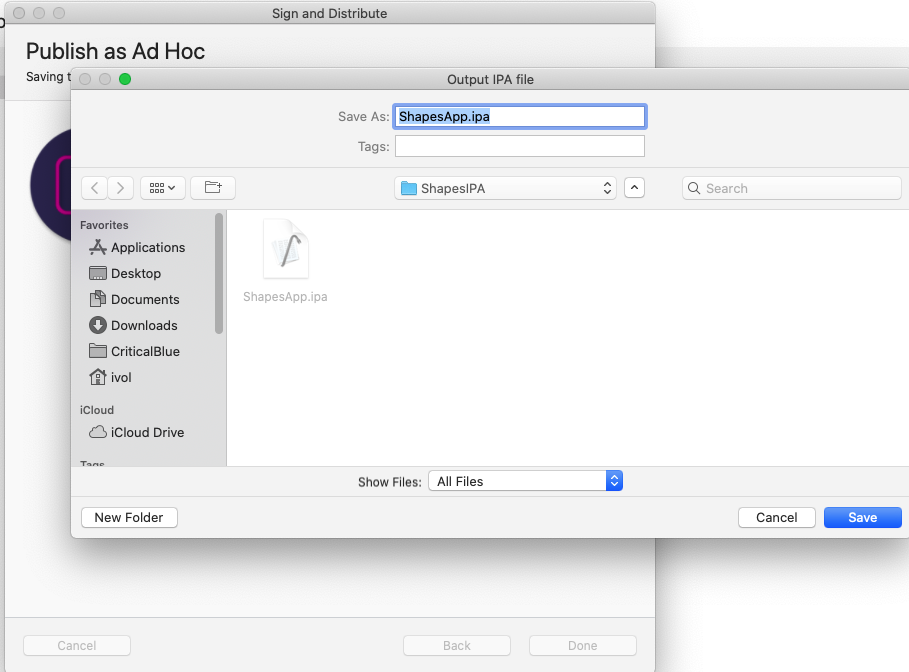

# Next Steps
Once you have finished a basic integration of the SDK and are able to see metrics from it, there are some further steps to provide full Approov integration.

These steps require access to the [Approov CLI](https://approov.io/docs/latest/approov-cli-tool-reference/), please follow the [Installation](https://approov.io/docs/latest/approov-installation/) instructions.

## ADDING API DOMAINS
In order for Approov tokens to be added by the interceptor for particular API domains is necessary to inform Approov about them. Execute the following command:

```
approov api -add <your-domain>
```
Approov tokens will then be added automatically to any requests to that domain (using the `Approov-Token` header, by default).

Note that this will also add a public key certicate pin for connections to the domain to ensure that no Man-in-the-Middle attacks on your app's communication are possible. Please read [Managing Pins](https://approov.io/docs/latest/approov-usage-documentation/#public-key-pinning-configuration) to understand this in more detail.

## REGISTERING APPS

In order for Approov to recognize the app as being valid it needs to be registered with the service. This requires building an `.ipa`/`.aar` file using the `Archive` option of Visual Studio (this option will not be available if using the simulator for iOS). Enabling codesigning is beyond the scope of this guide, if you need assistance please check [Microsoft's codesigning support](https://docs.microsoft.com/en-us/xamarin/ios/deploy-test/provisioning/) or [Android deploy signing](https://docs.microsoft.com/en-us/xamarin/android/deploy-test/signing/?tabs=macos). Make sure you have selected the correct project (Shapes.App.iOS), build mode (Release) and target device (Generic Device) settings. 


Select the `Build` menu and then `Archive for Publishing`. Once the archive file is ready you can either `Ad Hoc`, `Enterprise` or `Play Store` depending on the platform, sign it and save it to disk.



You can now register the ios application with the Approov service:

```
approov registration -add app.ipa
```

> **IMPORTANT:** The registration takes up to 30 seconds to propagate across the Approov Cloud Infrastructure, therefore don't try to run the app again before this time as elapsed. During development of your app you can [whitelist](https://approov.io/docs/latest/approov-usage-documentation/#adding-a-device-security-policy) your device to not have to register the IPA each time you modify it.

[Managing Registrations](https://approov.io/docs/latest/approov-usage-documentation/#managing-registrations) provides more details for app registrations.

Building an Android `apk` using the `Archive` option is very similar but please make sure to verify the Android project `Linker Options` in the `Android Build` settings are set to `Don't Link`, otherwise the building step will fail.

## BACKEND INTEGRATION
In order to fully implement Approov you must verify the Approov token in your backend API. Various [Backend API Quickstarts](https://approov.io/docs/latest/approov-integration-examples/backend-api/) are availble to suit your particular situation.

## OTHER FEATURES
There are various other Approov capabilities that you may wish to explore:

* Update your [Security Policy](https://approov.io/docs/latest/approov-usage-documentation/#security-policies) that determines the conditions under which an app will be given a valid Approov token.
* Learn how to [Manage Devices](https://approov.io/docs/latest/approov-usage-documentation/#managing-devices) that allows you to change the policies on specific devices.
* Understand how to provide access for other [Users](https://approov.io/docs/latest/approov-usage-documentation/#user-management) of your Approov account.
* Learn about [Automated Approov CLI Usage](https://approov.io/docs/latest/approov-usage-documentation/#automated-approov-cli-usage).
* Investigate other advanced features, such as [Offline Security Mode](https://approov.io/docs/latest/approov-usage-documentation/#offline-security-mode) and [DeviceCheck Integration](https://approov.io/docs/latest/approov-usage-documentation/#apple-devicecheck-integration).

## FURTHER OPTIONS

### Changing Approov Token Header Name
Note that the default header name of `Approov-Token` can be changed by editing the variable `ApproovTokenHeader` in the `ApproovHttpClient` class.  Moreover, a prefix to the header can be added in `ApproovTokenPrefix`. This is primarily for integrations where the JWT might need to be prefixed with Bearer, like the Authorization header.

### Token Binding
If you are using [Token Binding](https://approov.io/docs/latest/approov-usage-documentation/#token-binding) then set the header holding the value to be used for binding by means of the property `SetBindingHeader`, which takes the name of the header holding the value to be bound. The Approov SDK allows any string value to be bound to a particular token by computing its SHA256 hash and placing its base64 encoded value inside the pay claim of the JWT token. The property `SetBindingHeader` takes the name of the header holding the value to be bound. This only needs to be called once but the header needs to be present on all API requests using Approov. It is also crucial to use `SetBindingHeader` before any token fetch occurs, like token prefetching being enabled, since setting the value to be bound invalidates any (pre)fetched token.

### Token Prefetching
If you wish to reduce the latency associated with fetching the first Approov token, then a call to `PrefetchApproovToken()` can be made immediately after the SDK has been initialized. This initiates the process of fetching an Approov token as a background task, so that a cached token is available immediately when subsequently needed, or at least the fetch time is reduced. Note that if this feature is being used with [Token Binding](https://approov.io/docs/latest/approov-usage-documentation/#token-binding) then the binding must be set prior to the prefetch, as changes to the binding invalidate any cached Approov token.


### Build Dependencies
The ApproovSDK nuget package contains the native Approov SDK for both Android and iOS. The Android library uses [OkHttp](https://square.github.io/okhttp/) and Xamarin automatically downloads and packages a `.jar` file which can cause a build error if any other nuget package your application is using, also uses the same library. You will get a multiple definition error like this:

```
Type okhttp3.FormBody$Builder is defined multiple times:  obj/Debug/lp/3/jl/okhttp3.jar:okhttp3/FormBody$Builder.class, obj/Debug/lp/2/jl/okhttp-3.12.12.jar:okhttp3/FormBody$Builder.class
Compilation failed
```

The solution to this is to tell Xamarin to ignore one of the duplicate libraries (in this case we ignore okhttp3.jar) by adding the following assembly directive to your `AssemblyInfo.cs` project file:

```C#
[assembly: Java.Interop.DoNotPackage("okhttp3.jar")]
[assembly: Java.Interop.DoNotPackage("okio.jar")]
```