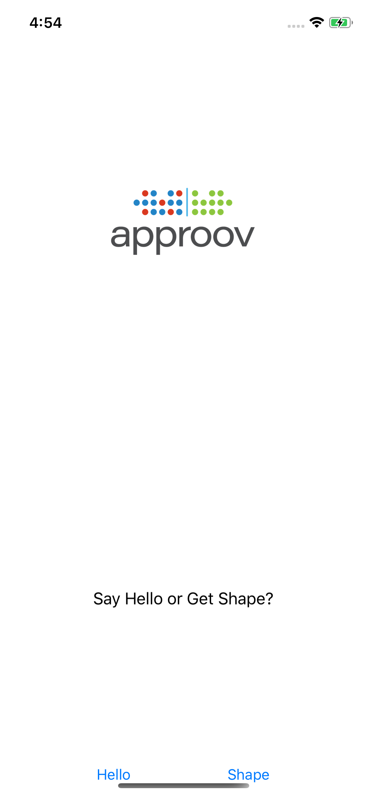
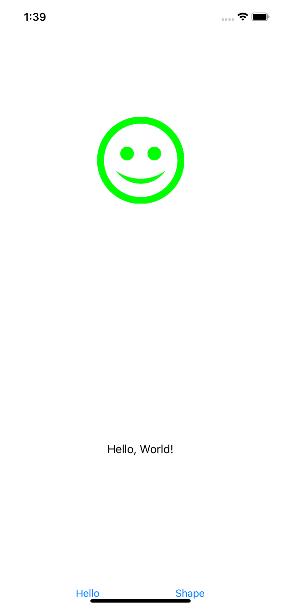
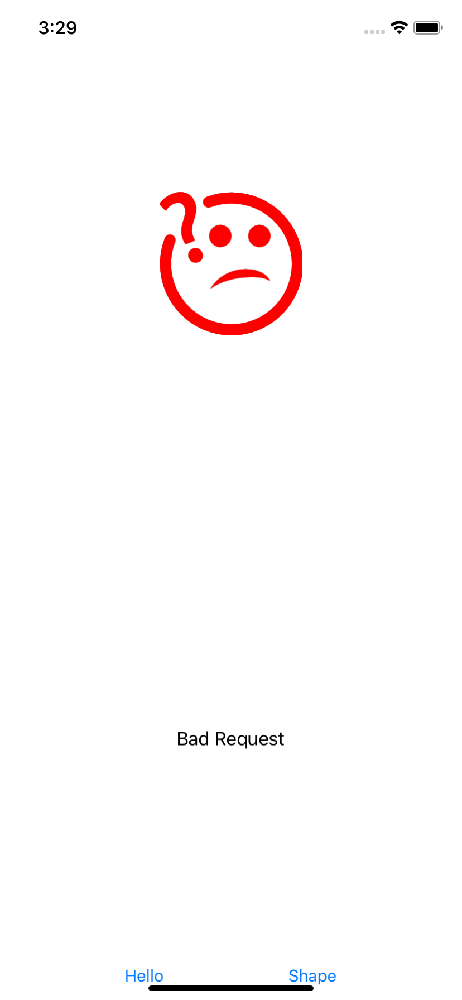
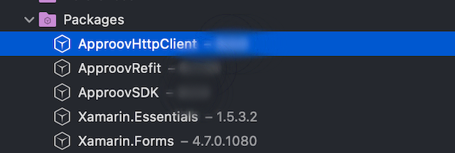

# Approov Quickstart: Xamarin Refit

This quickstart is written specifically for mobile iOS and Android apps that are written in C# for making the API calls that you wish to protect with Approov. The sample code shown in this guide makes use of [Refit](https://github.com/reactiveui/refit), an automatic type-safe REST library. If this is not your situation then check if there is a more relevant quickstart guide available.

## WHAT YOU WILL NEED
* Access to either the demo account ([request access here](https://info.approov.io/demo-token)) or a trial/paid Approov account
* The `approov` command line tool [installed](https://approov.io/docs/latest/approov-installation/) with environment variable `APPROOV_MANAGEMENT_TOKEN` set with your account access token
* [Visual Studio](https://visualstudio.microsoft.com/vs/mac/) with Xamarin extensions (Mac version 8.6.2 is used in this guide)
* The contents of the folder containing this README
* An Apple mobile device with iOS 10 or higher or an Android 5.0+ device. Alternatively, iOS simulator or Android emulator would suffice

## WHAT YOU WILL LEARN
* How to integrate Approov into a real app in a step by step fashion
* How to register your app to get valid tokens from Approov
* A solid understanding of how to integrate Approov into your own app that uses C# and `Refit`
* Some pointers to other Approov features

## RUNNING THE SHAPES APP WITHOUT APPROOV

Open the `ShapesApp.sln` solution in the `ShapesApp` folder using `File->Open` in Visual Studio. There are two projects in the solution, one targeting iOS and another targeting Android OS. We will use the iOS version in this document however there are minor differences with the Android application, i.e. codesigning and generating `.ipa` or `.apk` files.

Ensure the `ShapesApp.iOS` or the `Shapes.Droid` project is selected in the Solution panel and also the Build target of Visual Studio. If running the iOS application, select the `Info.plist` file and change the Bundle Identifier to contain a unique string (i.e. your company name), since Apple will reject the default one. Select the appropriate device/simulator target and run the ShapesApp application.

Once the application is running you will see two buttons:

<p>
    
</p>

Click on the `Hello`/Left button and you should see this:

<p>
    
</p>

This checks the connectivity by connecting to the endpoint `https://shapes.approov.io/v1/hello`. Now press the `Shape`/Right button and you will see this:

<p>
    
</p>

This contacts `https://shapes.approov.io/v2/shapes` to get the name of a random shape. It gets the status code 400 (`Bad Request`) because this endpoint is protected with an Approov token. Next, you will add Approov into the app so that it can generate valid Approov tokens and get shapes.

## ADD THE APPROOV SDK ENABLED REFIT PACKAGE

The ApproovSDK makes use of a custom `HttpClient` implementation, `ApproovHttpClient`. It needs a slightly modified `Refit` package using that specific implementation, and it is available as a NuGet package in the default repository `nuget.org`. You will need to uninstall the `Refit` package and replace it with the modified `ApproovRefit` one. Making sure you are selecting the appropriate project (either `ShapesApp.Droid` or `ShapesApp.iOS` depending on which platform you are targeting) select `Project` and `Manage NuGet Packages...`  and click on `Installed`; remove the `Refit` package. Select `Browse` and search for the `ApproovRefit` package. Select and install the package.


You will also need to install the custom `ApproovHttpClient` implementation, wich consists of the platform independent package `ApproovHttpClient` and its corresponding iOS/Android implementations `ApproovHttpClient-Platform-Specific`.


## ADD THE APPROOV SDK

The ApproovSDK is available as a NuGet package and at the time of writing this quickstart, the packages names and versions are:  and `ApproovSDK`(2.3.0.6).


Your project structure should now look like this:



## ENSURE THE SHAPES API IS PROTECTED

In order for Approov tokens to be generated for `https://shapes.approov.io/v2/shapes` it is necessary to inform Approov about it. If you are using a demo account this is unnecessary as it is already set up. For a trial account do:
```
$ approov api -add shapes.approov.io
```
Tokens for this domain will be automatically signed with the specific secret for this domain, rather than the normal one for your account.

## SETUP YOUR APPROOV CONFIGURATION

The Approov SDK needs a configuration string to identify the account associated with the app. Obtain it using:
```
$ approov sdk -getConfig approov-initial.config
```
We need to add the text file to our project and ensure it gets copied to the root directory of our app upon installation. In Visual Studio right click on the `Shapes.iOS`, select `Add` and then `Existing Files...` and select the `approov-initial.config` file. Make sure the `Copy the file to the directory` option is selected in the following options dialog. 

We now need to tell Visual Studio to copy the `approov-initial.config` during the app installation process by treating it as a resource bundle file. To do so, we right click on the `approov-initial.config` file and select `Build Action` and then `BundleResource`. 

If you are working with the Android application, select the `Assets` folder and similarly add the text file by making sure it is copied to the destination, rather than accessed as a link. There is no `BundleResource` in Android but the equivalent option is `AndroidAsset`. Make sure the `Build Action` is set to `AndroidAsset` otherwise the Approov SDK will not be initialized.


## MODIFY THE APP TO USE APPROOV

To use Approov all you have to do is comment out the code using `HttpClient` and document the line following that code, which enables the custom `ApproovHttpClient` code. If using the iOS project, find the following lines in `ViewController.cs` source file:
```C#
/* Comment out the line to use Approov SDK */
private HttpClient httpClient;
/* Uncomment the line to use Approov SDK */
//private IosApproovHttpClient httpClient;

public ViewController(IntPtr handle) : base(handle)
{
    /* Comment out the line to use Approov SDK */
    httpClient = new HttpClient
    /* Comment out the line to use Approov SDK */
    //httpClient = new IosApproovHttpClient
    {
```
Change the commented out lines so the code becomes:
```C#
/* Comment out the line to use Approov SDK */
//private HttpClient httpClient;
/* Uncomment the line to use Approov SDK */
private IosApproovHttpClient httpClient;

public ViewController(IntPtr handle) : base(handle)
{
    /* Comment out the line to use Approov SDK */
    //httpClient = new HttpClient
    /* Comment out the line to use Approov SDK */
    httpClient = new IosApproovHttpClient
    {
```

Similarly, if you are using Android, find the following lines in `MainActivity.cs`:
```C#
/* Without Approov */
private HttpClient httpClient;
/* With Approov */
//private AndroidApproovHttpClient httpClient;
protected override void OnCreate(Bundle savedInstanceState)
{
    base.OnCreate(savedInstanceState);
    Xamarin.Essentials.Platform.Init(this, savedInstanceState);
    SetContentView(Resource.Layout.activity_main);

    Android.Support.V7.Widget.Toolbar toolbar = FindViewById<Android.Support.V7.Widget.Toolbar>(Resource.Id.toolbar);
    SetSupportActionBar(toolbar);

    /* Without Approov */
    httpClient = new HttpClient
    /* With Approov */
    // httpClient = new AndroidApproovHttpClient
    {
```
Change the commented out lines so the code becomes:
```C#
/* Without Approov */
//private HttpClient httpClient;
/* With Approov */
private AndroidApproovHttpClient httpClient;
protected override void OnCreate(Bundle savedInstanceState)
{
    base.OnCreate(savedInstanceState);
    Xamarin.Essentials.Platform.Init(this, savedInstanceState);
    SetContentView(Resource.Layout.activity_main);

    Android.Support.V7.Widget.Toolbar toolbar = FindViewById<Android.Support.V7.Widget.Toolbar>(Resource.Id.toolbar);
    SetSupportActionBar(toolbar);

    /* Without Approov */
    //httpClient = new HttpClient
    /* With Approov */
    httpClient = new AndroidApproovHttpClient
    {
```

You will also need to add the `using Approov;` directive to the top of the `ViewController.cs`/`MainActivity.cs` source file.
The `IosApproovHttpClient`/`AndroidApproovHttpClient` class adds the `Approov-Token` header and also applies pinning for the connections to ensure that no Man-in-the-Middle can eavesdrop on any communication being made. 

## REGISTER YOUR APP WITH APPROOV

In order for Approov to recognize the app as being valid it needs to be registered with the service. This requires building an `.ipa`/`.aar` file using the `Archive` option of Visual Studio (this option will not be available if using the simulator for iOS). Enabling codesigning is beyond the scope of this guide, if you need assistance please check [Microsoft's codesigning support](https://docs.microsoft.com/en-us/xamarin/ios/deploy-test/provisioning/) or [Android deploy signing](https://docs.microsoft.com/en-us/xamarin/android/deploy-test/signing/?tabs=macos). Make sure you have selected the correct project (Shapes.App.iOS), build mode (Release) and target device (Generic Device) settings. 


Select the `Build` menu and then `Archive for Publishing`. Once the archive file is ready you can either `Ad Hoc`, `Enterprise` or `Play Store` depending on the platform, sign it and save it to disk.


You can now register the ios application with the Approov service:
```
$ approov registration -add ShapesApp.ipa
registering app ShapesApp
 3n4i6H5fQAXwSBkmDZVCtt+IoEp/Jr+0ONKpQkw5D10=com.criticalblue.ShapesApp-1.0[1.0]-4289  SDK:iOS(2.2.3)
registration successful
```

## RUNNING THE SHAPES APP WITH APPROOV

Install the `ApproovShapes.ipa` or `.apk` file that you just registered on the device. You will need to remove the old app from the device first.
If using Mac OS Catalina and targeting iOS, simply drag the `ipa` file to the device. Alternatively, using `Xcode` you can select `Window`, then `Devices and Simulators` and after selecting your device click on the small `+` sign to locate the `ipa` archive you would like to install. For Android you will need to use the command line tools provided by Google.


Launch the app and press the `Shape` button. You should now see this (or another shape):

<p>
    
</p>

This means that the app is getting a validly signed Approov token to present to the shapes endpoint.

## WHAT IF I DON'T GET SHAPES

If you still don't get a valid shape then there are some things you can try. Remember this may be because the device you are using has some characteristics that cause rejection for the currently set [Security Policy](https://approov.io/docs/latest/approov-usage-documentation/#security-policies) on your account:

* Ensure that the version of the app you are running is exactly the one you registered with Approov.
* If you are running the app from a debugger then valid tokens are not issued.
* Look at the [`syslog`](https://developer.apple.com/documentation/os/logging) output from the device. Information about any Approov token fetched or an error is printed, e.g. `Approov: Approov token for host: https://approov.io : {"anno":["debug","allow-debug"],"did":"/Ja+kMUIrmd0wc+qECR0rQ==","exp":1589484841,"ip":"2a01:4b00:f42d:2200:e16f:f767:bc0a:a73c","sip":"YM8iTv"}`. You can easily [check](https://approov.io/docs/latest/approov-usage-documentation/#loggable-tokens) the validity.

If you have a trial (as opposed to demo) account you have some additional options:
* Consider using an [Annotation Policy](https://approov.io/docs/latest/approov-usage-documentation/#annotation-policies) during development to directly see why the device is not being issued with a valid token.
* Use `approov metrics` to see [Live Metrics](https://approov.io/docs/latest/approov-usage-documentation/#live-metrics) of the cause of failure.
* You can use a debugger and get valid Approov tokens on a specific device by [whitelisting](https://approov.io/docs/latest/approov-usage-documentation/#adding-a-device-security-policy).

## CHANGING YOUR OWN APP TO USE APPROOV

### Configuration
This quick start guide has taken you through the steps of adding Approov to the shapes demonstration app using a modified version of `Refit`. If your app uses `HttpClient` to handle network connections you can replace it with the custom `IosApproovHttpClient` and `AndroidApproovHttpClient` instances by using the NuGet packages `ApproovHttpClient` and `ApproovHttpClient-Platform-Specific`. 

### HTTP PATCH
Unfortunately, currently it is not possible to use HTTP PATCH methods directly with `ApproovHttpClient`. As a workaround, it is possible to configure an `HttpRequestMessage` and modify its `Method` property to achieve the same result.

### API Domains
Remember you need to [add](https://approov.io/docs/latest/approov-usage-documentation/#adding-api-domains) all of the API domains that you wish to send Approov tokens for. You can still use the `ApproovRefit` REST API for other domains, but no `Approov-Token` will be sent; the `ApproovRefit` package should be fully compatible with a standard `Refit` package.

### Preferences
An Approov app automatically downloads any new configurations of APIs and their pins that are available. These are stored in the [`UserDefaults`](https://developer.apple.com/documentation/foundation/userdefaults) for the app in a preference key `approov-dynamic`.

### Changing Your API Backend
The Shapes example app uses the API endpoint `https://shapes.approov.io/v2/shapes` hosted on Approov's servers. If you want to integrate Approov into your own app you will need to [integrate](https://approov.io/docs/latest/approov-usage-documentation/#backend-integration) an Approov token check. Since the Approov token is simply a standard [JWT](https://en.wikipedia.org/wiki/JSON_Web_Token) this is usually straightforward. [Backend integration](https://approov.io/docs/latest/approov-integration-examples/backend-api/) examples provide a detailed walk-through for particular languages. Note that the default header name of `Approov-Token` can be changed by editing the variable `ApproovTokenHeader` in the `ApproovHttpClient` class.  Moreover, a prefix to the header can be added in `ApproovTokenPrefix`. This is primarily for integrations where the JWT might need to be prefixed with Bearer, like the Authorization header.

### Token Prefetching
If you wish to reduce the latency associated with fetching the first Approov token, then a call to `PrefetchApproovToken()` can be made immediately after the SDK has been initialized. This initiates the process of fetching an Approov token as a background task, so that a cached token is available immediately when subsequently needed, or at least the fetch time is reduced. Note that if this feature is being used with [Token Binding](https://approov.io/docs/latest/approov-usage-documentation/#token-binding) then the binding must be set prior to the prefetch, as changes to the binding invalidate any cached Approov token.

## NEXT STEPS

This quick start guide has shown you how to integrate Approov with your existing app. Now you might want to explore some other Approov features:

* Managing your app [registrations](https://approov.io/docs/latest/approov-usage-documentation/#managing-registrations)
* Manage the [pins](https://approov.io/docs/latest/approov-usage-documentation/#public-key-pinning-configuration) on the API domains to ensure that no Man-in-the-Middle attacks on your app's communication are possible.
* Update your [Security Policy](https://approov.io/docs/latest/approov-usage-documentation/#security-policies) that determines the conditions under which an app will be given a valid Approov token.
* Learn how to [Manage Devices](https://approov.io/docs/latest/approov-usage-documentation/#managing-devices) that allows you to change the policies on specific devices.
* Understand how to issue and revoke your own [Management Tokens](https://approov.io/docs/latest/approov-usage-documentation/#management-tokens) to control access to your Approov account.
* Use the [Metrics Graphs](https://approov.io/docs/latest/approov-usage-documentation/#metrics-graphs) to see live and accumulated metrics of devices using your account and any reasons for devices being rejected and not being provided with valid Approov tokens. You can also see your billing usage which is based on the total number of unique devices using your account each month.
* Use [Service Monitoring](https://approov.io/docs/latest/approov-usage-documentation/#service-monitoring) emails to receive monthly (or, optionally, daily) summaries of your Approov usage.
* Consider using [Token Binding](https://approov.io/docs/latest/approov-usage-documentation/#token-binding). The property `SetBindingHeader` takes the name of the header holding the value to be bound. This only needs to be called once but the header needs to be present on all API requests using Approov.
* Investigate other advanced features, such as [Offline Security Mode](https://approov.io/docs/latest/approov-usage-documentation/#offline-security-mode) and [DeviceCheck Integration](https://approov.io/docs/latest/approov-usage-documentation/#apple-devicecheck-integration).


